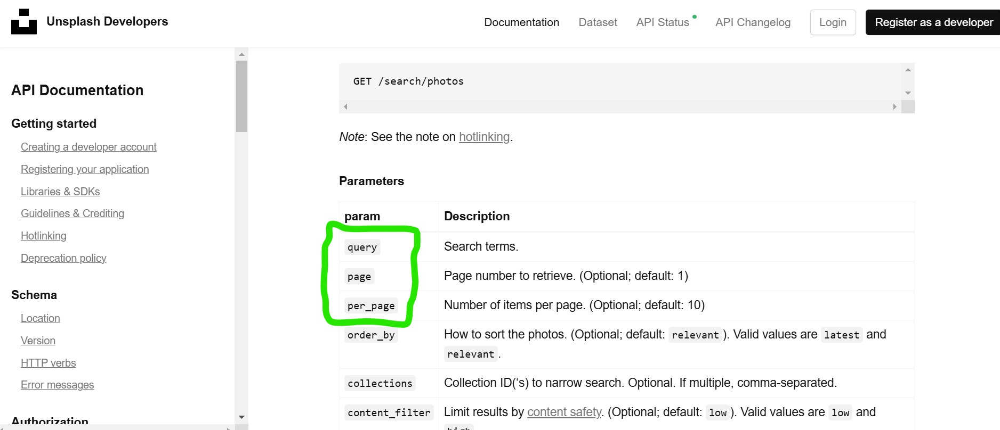

# Hur man tar ner 📥

Skriv i din terminal eller i din cmd "git clone <url>" dvs repo för den projektet .

## Hur man installerar 🛠️

Skriv först "npm install" i din terminal för att installera npm och skriv sedan "npm install vite-plugin-sass --save-dev install sass" för att installera sass i din terminal.

## Hur man kompilerar samt kör ditt projekt 🚀

När du är klar med alla installationer skriv bara i din terminal
"npm run dev" för att starta din app och se hur din websida ser ut och fungerar.

## Vilka mappar och filer som finns och vad som är vad 📂

Jag delade upp TS-filer i två mappar components map och src map. Huvudfilen finns i src-map och andra filar i komponentfil. Min Acces-key finns i Acces-key.ts file och lagt den i gitignore file så man kan inte ser den i githab. Jag delade också html till tre filar och sass till några filar men huvud filen heter app.scss.

### Vilket API du använder och vilka URLer du fetchar på 🌐

API = https://api.unsplash.com/photos/?client_id= min acces-key
URL = https://api.unsplash.com/search/photos?per-page=1&query=office i här urlen finns två endpoint per-page och query.
URL = https://api.unsplash.com/search/photos?page=1 i här urlen finns en endpoint page.

### Exempel på hur man använder API:et med fetch

```typescript
const accessKey = "din-access-key";
const endpoint = "https://api.unsplash.com/photos/?client_id=" + accessKey;

fetch(endpoint)
  .then((response) => response.json())
  .then((data) => {
    console.log(data);
    // Här kan du hantera den data som returneras från API:et
  })
  .catch((error) => {
    console.error("Error fetching data:", error);
  });
```




### Vilka teknologier, koncept, ramverk, bibliotek du använder 🧰

- TypeScript 
- Sass 
- Visual Studio Code 
- Vite 
- npm 

### Länk till din LinkedIn-profil 🔗

https://www.linkedin.com/in/mustafa-said-b6b164198/
